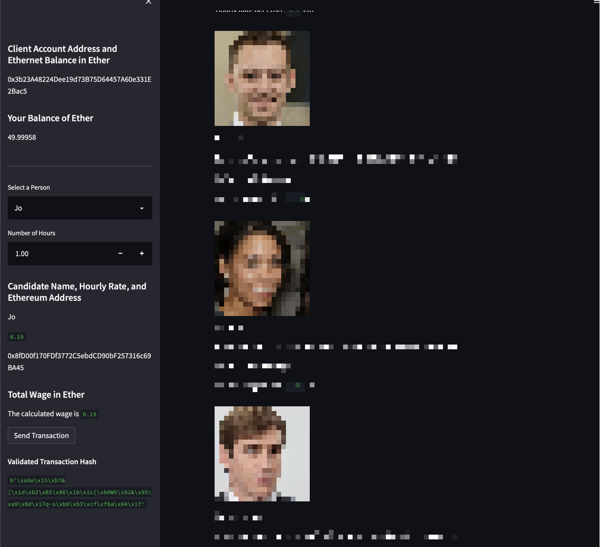
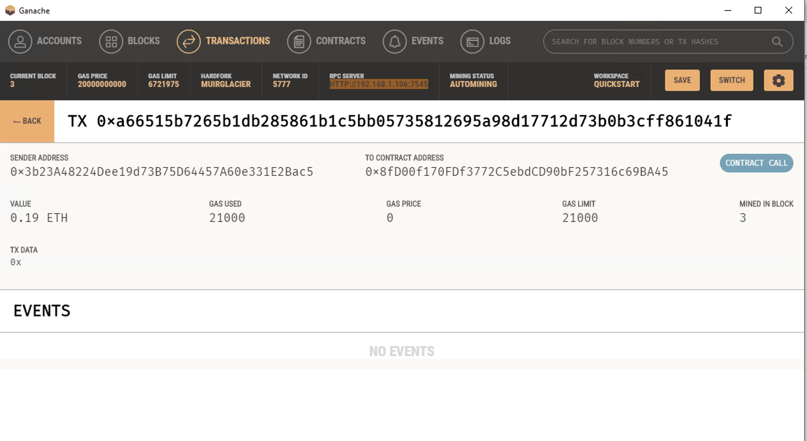

# Cryptocurrency-Wallet
Challenge / Project from Fintech Bootcamp for Blockchain-Wallets Week


### Python Prerequisites:
```shell
pip install web3
pip install bip44
pip install streamlit
pip install python-dotenv
```

### How to Run:


```shell
git clone git@github.com:nomadic-me/Cryptocurrency-Wallet.git
cd Cryptocurrency-Wallet
streamlit run fintech_finder.py
```
### What to notice in the screenshots
You can see the: 
- *Client Account Address* 
    - ```0x3b23A48224Dee19d73B75D64457A60e331E2Bac5```
- *Candidate Name: Jo*
    - ```0x8fD00f170FDf3772C5ebdCD90bF257316c69BA45```
- Wage transfered:
    - ```0.19 Ether```


### Screenshots:
This is the screenshot of the Send Transaction from the Streamlit App




These details can be seen in the transaction details of Ganache as well

```
Validated Transaction Hash
b'\xa6e\x15\xb7&[\x1d\xb2\x85\x86\x1b\x1c[\xb0W5\x81&\x95\xa9\x8d\x17q-s\xb0\xb3\xcf\xf8a\x04\x1f'
```